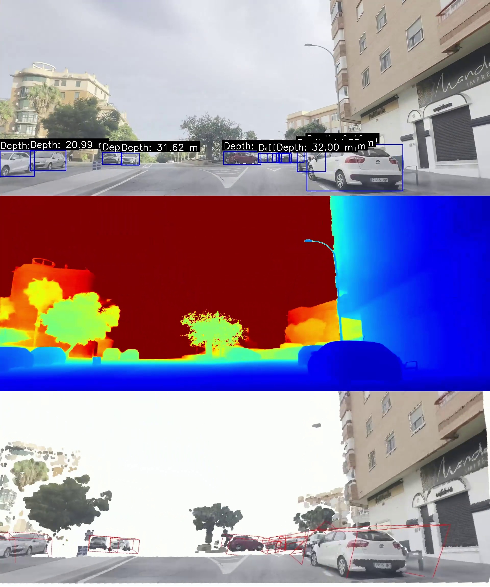

# Monocular Depth-Based 3D Object Detection
<p align="center">
  
</p>
## Overview

This repository provides a robust pipeline for monocular depth estimation and object detection using deep learning. It integrates:

-   **YOLO** for object detection and segmentation.
    
-   **Depth estimation** based on Apple's [ml-depth-pro](https://github.com/apple/ml-depth-pro) model.
    
-   **3D bounding box extraction** from segmented objects using Open3D.
    

The system takes **monocular images** (single-camera view) as input, estimates depth, detects and segments objects, and reconstructs 3D information for further analysis.

## Key Features

-   **Monocular depth estimation** to derive real-world distances.
    
-   **Object detection** using YOLO for identifying and localizing objects.
    
-   **Segmentation-based 3D reconstruction** for precise object depth extraction.
    
-   **Point cloud generation** to visualize depth-aware object positioning.
## Pipeline Description

The workflow is implemented in two main scripts:

### 1. `distance_estimation_yolo_video.py`

**Objective:** Detect objects in images, estimate depth, and annotate images with distance information.

#### Algorithm:

1.  **Load models**: Initialize YOLO for object detection and a depth estimation model.
    
2.  **Process each image**:
    
    -   Apply **YOLO detection** to locate objects.
        
    -   Perform **monocular depth estimation** using ml-depth-pro.
        
    -   Extract **depth values** for detected objects.
        
    -   Annotate images with **distance information**.
        
3.  **Save results**:
    
    -   Image with bounding boxes and depth annotations.
        
    -   Depth map visualization using `matplotlib`.
        

### 2. `seg_3d_bbox_video.py`

**Objective:** Convert detected objects into 3D point clouds and extract 3D bounding boxes.

#### Algorithm:

1.  **Load camera calibration parameters**.
    
2.  **Process each image**:
    
    -   Detect objects using **YOLO segmentation**.
        
    -   Estimate **depth map** for the input image.
        
    -   Generate a **dense 3D point cloud**.
        
    -   Extract **segmented object point clouds** from masks.
        
    -   Compute **3D bounding boxes** for each detected object.
        
3.  **Visualize and save**:
    
    -   Render and save **3D point clouds with bounding boxes**.
## Requirements

Install dependencies using:

```
pip install -r requirements.txt
```

**Key Libraries:**

-   `ultralytics` (YOLO object detection and segmentation)
    
-   `torch` (Deep learning inference)
    
-   `open3d` (3D point cloud processing)
    
-   `matplotlib` (Visualization)
    
-   `numpy`, `opencv-python` (Image processing)

## eferences

-   Depth Estimation: [ml-depth-pro](https://github.com/apple/ml-depth-pro)
    
-   Object Detection & Segmentation: [Ultralytics YOLO](https://github.com/ultralytics/ultralytics)
    

## Acknowledgments

This work integrates state-of-the-art deep learning models for monocular depth estimation and object detection to provide a comprehensive 3D perception system.

## License

This project is licensed under the MIT License.